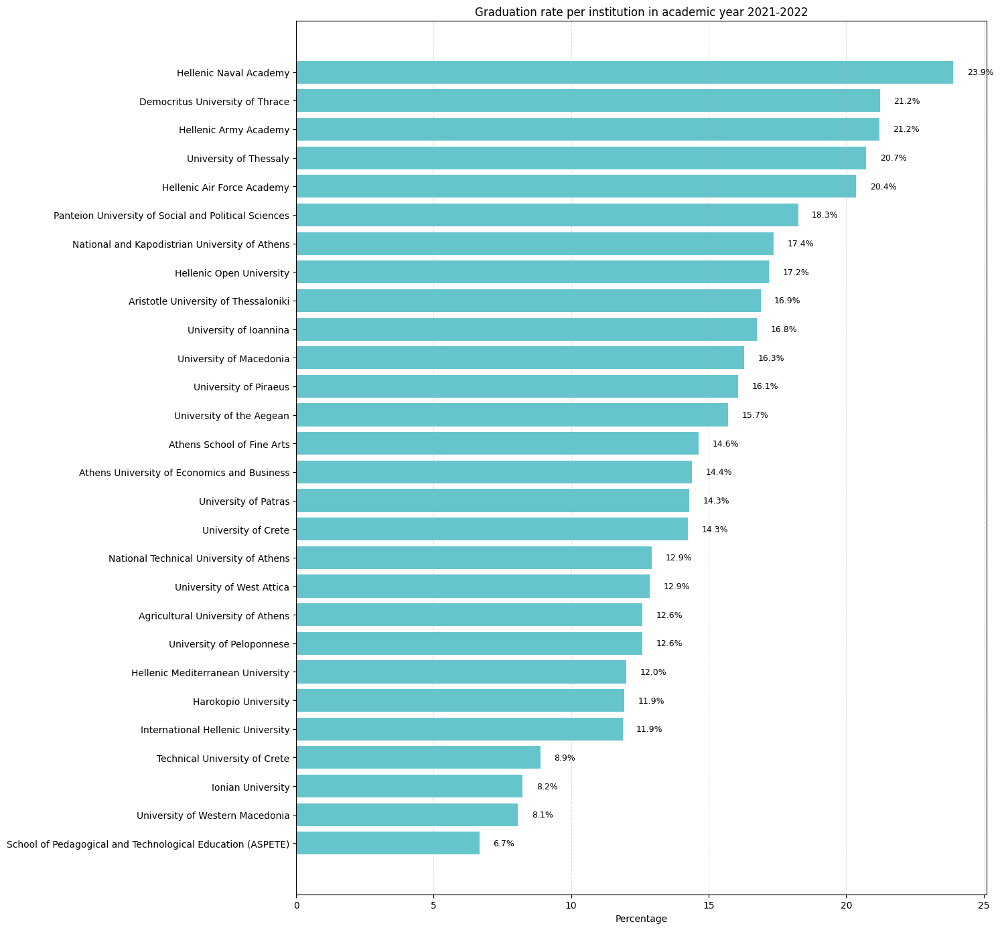
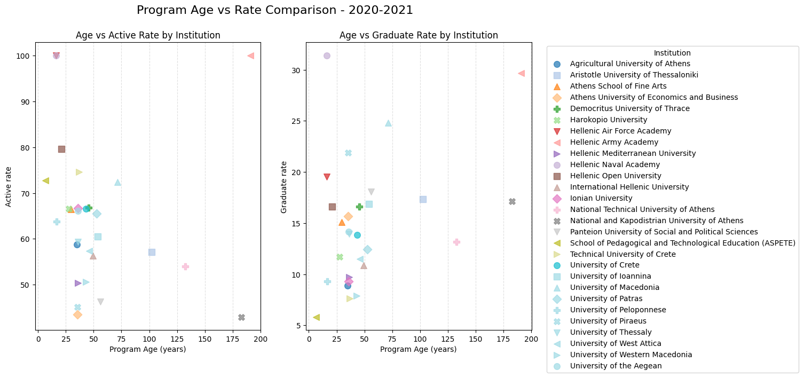

```python
import numpy as np
import pandas as pd
import matplotlib.pyplot as plt
from typing import List

import os
for dirname, _, filenames in os.walk('/kaggle/input'):
    for filename in filenames:
        print(os.path.join(dirname, filename))

!pip install pypalettes
from pypalettes import load_cmap
```

    /kaggle/input/hahe-statistics-all-programmes/hahe_all_21_24.csv
    Collecting pypalettes
      Downloading pypalettes-0.2.1-py3-none-any.whl.metadata (5.4 kB)
    Downloading pypalettes-0.2.1-py3-none-any.whl (367 kB)
       ━━━━━━━━━━━━━━━━━━━━━━━━━━━━━━━━━━━━━━━━ 367.3/367.3 kB 17.3 MB/s eta 0:00:00
    [?25hInstalling collected packages: pypalettes
    Successfully installed pypalettes-0.2.1


```python
df = pd.read_csv("/kaggle/input/hahe-statistics-all-programmes/hahe_all_21_24.csv")
YEARS = ["2020-2021", "2021-2022", "2022-2023", "2023-2024"]
METRICS = ["enrolled", "graduate", "active", "registered"]
cmap = load_cmap("Pastel")
```


```python
def plot_stats_by_major(program_themes:  List[str]):
    if len(program_themes) > 1:
        themes = "|".join(program_themes)
    else:
        themes = program_themes[0]
    df_filtered = df[df["program"].str.contains(themes, na=False)]
    programs_num = df_filtered.groupby("institution")["program"].nunique().reset_index(name="unique_programs").sum()['unique_programs']
    print(f"The number of {program_themes[0].title()} themed departments is {programs_num}")
    
    graduates = []
    enrolled = []
    active = []
    registered = []
    
    for year in YEARS:
        graduates.append(df_filtered[df_filtered["academic_year"] == year]["graduate"].sum())
        enrolled.append(df_filtered[df_filtered["academic_year"] == year]["enrolled"].sum())
        active.append(df_filtered[df_filtered["academic_year"] == year]["active"].sum())
        registered.append(df_filtered[df_filtered["academic_year"] == year]["registered"].sum())
    
    plt.figure(figsize=(8,5))
    
    plt.plot(YEARS,graduates, marker='o', label="Graduates")
    plt.plot(YEARS, enrolled, marker='o', label="Enrolled")
    
    plt.xlabel("Academic Year")
    plt.ylabel("Number of Students")
    plt.title(f"{program_themes[0].title()} – Graduates & Enrolled Students per Academic Year")
    plt.grid(True)
    plt.legend()
    plt.show()
    
    plt.figure(figsize=(8,5))
    plt.plot(YEARS, active, marker='o', label="Active")
    plt.plot(YEARS, registered, marker='o', label="Registered")
    plt.xlabel("Academic Year")
    plt.ylabel("Number of Students")
    plt.title(f"{program_themes[0].title()} – Active & Registered Students per Academic Year")
    plt.grid(True)
    plt.legend()
    plt.show()
```


```python
majors = [
    ["Law"],
    ["Informatics", "Computer Science"],
    ["Medicine"],
    ["Engineering"],
    ["Business"],
    ["Marketing", "Market"],
    ["Literature"],
    ["Psychology"],
    ["Economics", "Finance", "Financial", "Econom", "Accounting"],
    ["Military Sciences", "Aviation Sciences", "Naval Sciences"]
]

for m in majors:
    plot_stats_by_major(m)
```

    The number of Law themed departments is 3


    

    


    

    


    The number of Informatics themed departments is 30


    

    


    

    


    The number of Medicine themed departments is 10


    

    


    

    


    The number of Engineering themed departments is 110


    

    


    

    


    The number of Business themed departments is 26


    

    


    

    


    The number of Marketing themed departments is 2


    

    


    

    


    The number of Literature themed departments is 11


    

    


    

    


    The number of Psychology themed departments is 8


    

    


    

    


    The number of Economics themed departments is 38


    

    


    

    


    The number of Military Sciences themed departments is 3


    

    


    

    


```python
def calc_active_rate(df_filtered):
    pct = []
    for year in YEARS:
        active = df_filtered[df_filtered["academic_year"] == year]["active"].sum()
        registered = df_filtered[df_filtered["academic_year"] == year]["registered"].sum()
        
        if registered == 0:
            pct.append(0)
        else:
            pct.append((active / registered) * 100)
    return pct

def calc_graduate_rate(df_filtered):
    pct = []
    for year in YEARS:
        graduate = df_filtered[df_filtered["academic_year"] == year]["graduate"].sum()
        active = df_filtered[df_filtered["academic_year"] == year]["active"].sum()
        if active == 0:
            pct.append(0)
        else:
            pct.append((graduate / active) * 100)
    return pct
```


```python
act_rates = []
grad_rates = []
for m in majors:
    if len(m) > 1:
        program_major = "|".join(m)
    else:
        program_major = m[0]
    df_filtered = df[df["program"].str.contains(program_major, na=False, regex=True)]
    act_rates.append(calc_active_rate(df_filtered))
    grad_rates.append(calc_graduate_rate(df_filtered))

plt.figure(figsize=(10,6))

for m, rate in zip (majors, act_rates):
    plt.plot(YEARS, rate, marker='o', label=m[0])

plt.xlabel("Academic Year")
plt.ylabel("Active Rate (%)")
plt.title("Active Rate by Major")
plt.grid(True)
plt.ylim(0, 110)
plt.legend(loc='center left', bbox_to_anchor=(1, 0.5))
plt.show()


plt.figure(figsize=(10,6))

for m, rate in zip (majors, grad_rates):
    plt.plot(YEARS, rate, marker='o', label=m[0])

plt.xlabel("Academic Year")
plt.ylabel("Graduation Rate (%)")
plt.title("Graduation Rate by Major")
plt.grid(True)
plt.ylim(0, 50)
plt.legend(loc='center left', bbox_to_anchor=(1, 0.5))
plt.show()
```


    

    


    

    


```python
df['established'] = pd.to_datetime(
    df['established'], 
    format="%d/%m/%Y" # Correct format for day/month/year
)
# The established date defined here is not the correct one, since this code finds the oldest estsablished program
# An instituion's might be established date earlier, with programmes that currectly are not offered
df_grouped = (
    df.groupby(['institution', 'academic_year'], as_index=False)
      .agg({
          'established': 'min', 
          'program': 'count',
          'graduate': 'sum',
          'registered': 'sum',
          'enrolled': 'sum',
          'active': 'sum'
      })
)
df_grouped
```


<div>
<style scoped>
    .dataframe tbody tr th:only-of-type {
        vertical-align: middle;
    }

    .dataframe tbody tr th {
        vertical-align: top;
    }

    .dataframe thead th {
        text-align: right;
    }
</style>
<table border="1" class="dataframe">
  <thead>
    <tr style="text-align: right;">
      <th></th>
      <th>institution</th>
      <th>academic_year</th>
      <th>established</th>
      <th>program</th>
      <th>graduate</th>
      <th>registered</th>
      <th>enrolled</th>
      <th>active</th>
    </tr>
  </thead>
  <tbody>
    <tr>
      <th>0</th>
      <td>Agricultural University of Athens</td>
      <td>2020-2021</td>
      <td>1985-03-28</td>
      <td>12</td>
      <td>701</td>
      <td>13442</td>
      <td>1532</td>
      <td>7900</td>
    </tr>
    <tr>
      <th>1</th>
      <td>Agricultural University of Athens</td>
      <td>2021-2022</td>
      <td>1985-03-28</td>
      <td>12</td>
      <td>911</td>
      <td>13318</td>
      <td>832</td>
      <td>7232</td>
    </tr>
    <tr>
      <th>2</th>
      <td>Agricultural University of Athens</td>
      <td>2022-2023</td>
      <td>1985-03-28</td>
      <td>12</td>
      <td>907</td>
      <td>13225</td>
      <td>923</td>
      <td>6897</td>
    </tr>
    <tr>
      <th>3</th>
      <td>Agricultural University of Athens</td>
      <td>2023-2024</td>
      <td>1985-03-28</td>
      <td>12</td>
      <td>883</td>
      <td>12846</td>
      <td>883</td>
      <td>6490</td>
    </tr>
    <tr>
      <th>4</th>
      <td>Aristotle University of Thessaloniki</td>
      <td>2020-2021</td>
      <td>1917-09-14</td>
      <td>42</td>
      <td>7327</td>
      <td>73948</td>
      <td>9095</td>
      <td>42220</td>
    </tr>
    <tr>
      <th>...</th>
      <td>...</td>
      <td>...</td>
      <td>...</td>
      <td>...</td>
      <td>...</td>
      <td>...</td>
      <td>...</td>
      <td>...</td>
    </tr>
    <tr>
      <th>107</th>
      <td>University of Western Macedonia</td>
      <td>2023-2024</td>
      <td>1976-10-14</td>
      <td>35</td>
      <td>2481</td>
      <td>39041</td>
      <td>3385</td>
      <td>15894</td>
    </tr>
    <tr>
      <th>108</th>
      <td>University of the Aegean</td>
      <td>2020-2021</td>
      <td>1984-03-20</td>
      <td>18</td>
      <td>1606</td>
      <td>17163</td>
      <td>3132</td>
      <td>11353</td>
    </tr>
    <tr>
      <th>109</th>
      <td>University of the Aegean</td>
      <td>2021-2022</td>
      <td>1984-03-20</td>
      <td>18</td>
      <td>1702</td>
      <td>17688</td>
      <td>2327</td>
      <td>10830</td>
    </tr>
    <tr>
      <th>110</th>
      <td>University of the Aegean</td>
      <td>2022-2023</td>
      <td>1984-03-20</td>
      <td>18</td>
      <td>1308</td>
      <td>17688</td>
      <td>2102</td>
      <td>10712</td>
    </tr>
    <tr>
      <th>111</th>
      <td>University of the Aegean</td>
      <td>2023-2024</td>
      <td>1984-03-20</td>
      <td>18</td>
      <td>1099</td>
      <td>18567</td>
      <td>2370</td>
      <td>10607</td>
    </tr>
  </tbody>
</table>
<p>112 rows × 8 columns</p>
</div>


```python
df_inspect = df_grouped[df_grouped['academic_year'] == '2020-2021']
metric = 'graduate'
total_metric = df_inspect[metric].sum()
print(total_metric)

top_10 = df_inspect.sort_values(by=metric, ascending=False).head(10)
other = df_inspect.sort_values(by=metric, ascending=False).tail(len(df_inspect) - 10)
institutions = np.concatenate([top_10["institution"], ["Other"]])
values, insts = np.concatenate([top_10[metric], [other[metric].sum()]]), institutions
values_prcs = list(map(lambda v: v * 100 / total_metric, values))
```

    56728


```python
def wrap_label(label, words_per_line=3):
    words = label.split()
    return "\n".join(
        [" ".join(words[i:i + words_per_line]) for i in range(0, len(words), words_per_line)]
    )

def plot_bar_metrics(df):
    # Build consistent global color mapping
    cmap_global = cmap.colors
    
    n_years = len(YEARS)
    n_metrics = len(METRICS)

    fig, axes = plt.subplots(n_years, n_metrics, figsize=(6 * n_metrics, 6 * n_years))

    if n_years == 1:
        axes = np.expand_dims(axes, axis=0)

    for i, year in enumerate(YEARS):
        df_filtered = df[df["academic_year"] == year]
        
        for j, metric in enumerate(METRICS):
            ax = axes[i, j]
            
            sum_metric = df_filtered[metric].sum()
            top_6 = df_filtered.sort_values(by=metric, ascending=False).head(6)
            other = df_filtered.sort_values(by=metric, ascending=False).tail(len(df_filtered) - 6)
            institutions = np.concatenate([top_6["institution"], ["Other"]])
            values, institutions = np.concatenate([top_6[metric], [other[metric].sum()]]), institutions
            values_prcs = list(map(lambda v: v * 100 / sum_metric, values))

            y_pos = np.arange(len(institutions))
            bars = ax.barh(y_pos, values_prcs, align="center", color=cmap.colors[0])

            # Wrap labels for Y-axis
            wrapped_labels = []
            for inst in institutions:
                wpl = 3
                if len(inst.split()) == 3:
                    wpl = 2
                wrapped_labels.append(wrap_label(inst, wpl))

            ax.set_yticks(y_pos)
            ax.set_yticklabels(wrapped_labels)

            for bar in bars:
                width = bar.get_width()
                ax.text(
                    width + 0.3,           # small offset to the right
                    bar.get_y() + bar.get_height()/2,
                    f'{width:.1f}%',       # formatted value
                    va='center',           # vertical alignment
                    fontsize=9
                )

            # Titles + styling
            ax.set_title(f"{metric.title()} — {year}", pad=10)
            ax.invert_yaxis()  # highest first
            ax.grid(axis="x", linestyle="--", alpha=0.4)
            ax.set_xlim(0, 60)

    plt.tight_layout()
    plt.show()

# Call it
plot_bar_metrics(df_grouped)
```


    

    


```python
def add_rates(df):
    df = df.copy()
    df["active_rate"] = (df["active"] / df["registered"]) * 100
    df["graduate_rate"] = (df["graduate"] / df["active"]) * 100
    return df
```


```python
df_grouped_rates = add_rates(df_grouped)
df_grouped_rates
```


<div>
<style scoped>
    .dataframe tbody tr th:only-of-type {
        vertical-align: middle;
    }

    .dataframe tbody tr th {
        vertical-align: top;
    }

    .dataframe thead th {
        text-align: right;
    }
</style>
<table border="1" class="dataframe">
  <thead>
    <tr style="text-align: right;">
      <th></th>
      <th>institution</th>
      <th>academic_year</th>
      <th>established</th>
      <th>program</th>
      <th>graduate</th>
      <th>registered</th>
      <th>enrolled</th>
      <th>active</th>
      <th>active_rate</th>
      <th>graduate_rate</th>
    </tr>
  </thead>
  <tbody>
    <tr>
      <th>0</th>
      <td>Agricultural University of Athens</td>
      <td>2020-2021</td>
      <td>1985-03-28</td>
      <td>12</td>
      <td>701</td>
      <td>13442</td>
      <td>1532</td>
      <td>7900</td>
      <td>58.771016</td>
      <td>8.873418</td>
    </tr>
    <tr>
      <th>1</th>
      <td>Agricultural University of Athens</td>
      <td>2021-2022</td>
      <td>1985-03-28</td>
      <td>12</td>
      <td>911</td>
      <td>13318</td>
      <td>832</td>
      <td>7232</td>
      <td>54.302448</td>
      <td>12.596792</td>
    </tr>
    <tr>
      <th>2</th>
      <td>Agricultural University of Athens</td>
      <td>2022-2023</td>
      <td>1985-03-28</td>
      <td>12</td>
      <td>907</td>
      <td>13225</td>
      <td>923</td>
      <td>6897</td>
      <td>52.151229</td>
      <td>13.150645</td>
    </tr>
    <tr>
      <th>3</th>
      <td>Agricultural University of Athens</td>
      <td>2023-2024</td>
      <td>1985-03-28</td>
      <td>12</td>
      <td>883</td>
      <td>12846</td>
      <td>883</td>
      <td>6490</td>
      <td>50.521563</td>
      <td>13.605547</td>
    </tr>
    <tr>
      <th>4</th>
      <td>Aristotle University of Thessaloniki</td>
      <td>2020-2021</td>
      <td>1917-09-14</td>
      <td>42</td>
      <td>7327</td>
      <td>73948</td>
      <td>9095</td>
      <td>42220</td>
      <td>57.094174</td>
      <td>17.354334</td>
    </tr>
    <tr>
      <th>...</th>
      <td>...</td>
      <td>...</td>
      <td>...</td>
      <td>...</td>
      <td>...</td>
      <td>...</td>
      <td>...</td>
      <td>...</td>
      <td>...</td>
      <td>...</td>
    </tr>
    <tr>
      <th>107</th>
      <td>University of Western Macedonia</td>
      <td>2023-2024</td>
      <td>1976-10-14</td>
      <td>35</td>
      <td>2481</td>
      <td>39041</td>
      <td>3385</td>
      <td>15894</td>
      <td>40.711047</td>
      <td>15.609664</td>
    </tr>
    <tr>
      <th>108</th>
      <td>University of the Aegean</td>
      <td>2020-2021</td>
      <td>1984-03-20</td>
      <td>18</td>
      <td>1606</td>
      <td>17163</td>
      <td>3132</td>
      <td>11353</td>
      <td>66.148109</td>
      <td>14.146041</td>
    </tr>
    <tr>
      <th>109</th>
      <td>University of the Aegean</td>
      <td>2021-2022</td>
      <td>1984-03-20</td>
      <td>18</td>
      <td>1702</td>
      <td>17688</td>
      <td>2327</td>
      <td>10830</td>
      <td>61.227951</td>
      <td>15.715605</td>
    </tr>
    <tr>
      <th>110</th>
      <td>University of the Aegean</td>
      <td>2022-2023</td>
      <td>1984-03-20</td>
      <td>18</td>
      <td>1308</td>
      <td>17688</td>
      <td>2102</td>
      <td>10712</td>
      <td>60.560832</td>
      <td>12.210605</td>
    </tr>
    <tr>
      <th>111</th>
      <td>University of the Aegean</td>
      <td>2023-2024</td>
      <td>1984-03-20</td>
      <td>18</td>
      <td>1099</td>
      <td>18567</td>
      <td>2370</td>
      <td>10607</td>
      <td>57.128238</td>
      <td>10.361082</td>
    </tr>
  </tbody>
</table>
<p>112 rows × 10 columns</p>
</div>


```python
def plot_graduation_rate(df):
    for year in YEARS:
        df_filtered = df[df["academic_year"] == year].sort_values(by="graduate_rate", ascending=False)
        y_pos = np.arange(len(df_filtered))
        fig_height = max(6, len(df_filtered) * 0.5)
        fig, ax = plt.subplots(figsize=(15, fig_height))

        bars = ax.barh(y_pos, df_filtered["graduate_rate"], align="center", color=cmap.colors[0])
        ax.set_yticks(y_pos)
        ax.set_yticklabels(df_filtered["institution"])
        ax.invert_yaxis()
        ax.set_xlabel("Percentage")
        ax.set_title(f"Graduation rate per institution in academic year {year}")
        ax.grid(axis="x", linestyle="--", alpha=0.4)

        # Add values next to bars
        for bar in bars:
            width = bar.get_width()
            ax.text(
                width + 0.5,           # small offset to the right
                bar.get_y() + bar.get_height()/2,
                f'{width:.1f}%',       # formatted value
                va='center',           # vertical alignment
                fontsize=9
            )

        plt.tight_layout()
    plt.show()


def plot_active_rate(df):
    prcs = []
    for year in YEARS:
        df_filtered = df[df["academic_year"] == year].sort_values(by="active_rate", ascending=False)
        prcs.append(df_filtered["active_rate"])
        y_pos = np.arange(len(df_filtered))
        fig_height = max(6, len(df_filtered) * 0.5)
        fig, ax = plt.subplots(figsize=(15, fig_height))

        bars = ax.barh(y_pos, df_filtered["active_rate"], align="center", color=cmap.colors[1])
        ax.set_yticks(y_pos)
        ax.set_yticklabels(df_filtered["institution"])
        ax.invert_yaxis()
        ax.set_xlabel("Percentage")
        ax.set_title(f"Student active rate per institution in academic year {year}")
        ax.grid(axis="x", linestyle="--", alpha=0.4)

        # Add values next to bars
        for bar in bars:
            width = bar.get_width()
            ax.text(
                width + 0.5,           # small offset to the right
                bar.get_y() + bar.get_height()/2,
                f'{width:.1f}%',       # formatted value
                va='center',           # vertical alignment
                fontsize=9
            )

        plt.tight_layout()
    plt.show()

plot_graduation_rate(df_grouped_rates)
plot_active_rate(df_grouped_rates)
```


    

    


    

    


    

    


    

    


    

    


    

    


    

    


    

    


```python
def plot_scatter_plot(df):
    for year in YEARS:
        df_filtered = df[df["academic_year"] == year]
        df_filtered['age'] = (
            pd.to_datetime(df_filtered['academic_year'].str.split('-').str[0], format="%Y")
            - pd.to_datetime(df_filtered['established'], format="%d/%m/%Y")
        ) / pd.Timedelta(days=365.25)
        fig, axes = plt.subplots(1,2 ,figsize=(12, 7))
    
        markers = ['o', 's', '^', 'D', 'P', 'X', 'v', '<', '>']  # cycle through shapes
        colors = plt.colormaps.get_cmap("tab20")
        rates = ['active_rate', 'graduate_rate']
        for i, r in enumerate(rates):
            for j, (inst, group) in enumerate(df_filtered.groupby('institution')):
                ax = axes[i]
                ax.scatter(
                    group['age'],
                    group[r],
                    alpha=0.7,
                    label=inst,
                    color=colors(j),
                    marker=markers[j % len(markers)],
                    s=70
                )
            ax.set_title(f"Age vs {r.replace('_', ' ').title()} by Institution")
            ax.set_xlabel("Program Age (years)")
            ax.set_ylabel(r.replace('_', ' ').capitalize())
            ax.grid(axis="x", linestyle="--", alpha=0.4)
            
        plt.legend(title="Institution", bbox_to_anchor=(1.05, 1), loc='upper left')
        fig.suptitle(f"Program Age vs Rate Comparison - {year}", fontsize=16)
    plt.show()

plot_scatter_plot(df_grouped_rates)
```

    /tmp/ipykernel_47/632292643.py:4: SettingWithCopyWarning: 
    A value is trying to be set on a copy of a slice from a DataFrame.
    Try using .loc[row_indexer,col_indexer] = value instead
    
    See the caveats in the documentation: https://pandas.pydata.org/pandas-docs/stable/user_guide/indexing.html#returning-a-view-versus-a-copy
      df_filtered['age'] = (
    /tmp/ipykernel_47/632292643.py:4: SettingWithCopyWarning: 
    A value is trying to be set on a copy of a slice from a DataFrame.
    Try using .loc[row_indexer,col_indexer] = value instead
    
    See the caveats in the documentation: https://pandas.pydata.org/pandas-docs/stable/user_guide/indexing.html#returning-a-view-versus-a-copy
      df_filtered['age'] = (
    /tmp/ipykernel_47/632292643.py:4: SettingWithCopyWarning: 
    A value is trying to be set on a copy of a slice from a DataFrame.
    Try using .loc[row_indexer,col_indexer] = value instead
    
    See the caveats in the documentation: https://pandas.pydata.org/pandas-docs/stable/user_guide/indexing.html#returning-a-view-versus-a-copy
      df_filtered['age'] = (
    /tmp/ipykernel_47/632292643.py:4: SettingWithCopyWarning: 
    A value is trying to be set on a copy of a slice from a DataFrame.
    Try using .loc[row_indexer,col_indexer] = value instead
    
    See the caveats in the documentation: https://pandas.pydata.org/pandas-docs/stable/user_guide/indexing.html#returning-a-view-versus-a-copy
      df_filtered['age'] = (


    

    


    

    


    

    


    

    


```python
df_overall = df.groupby("academic_year", as_index=False)[["graduate", "registered", "enrolled", "active"]].sum()
df_overall["gradaute_rate"] = (df_overall["graduate"] / df_overall["active"]) * 100
df_overall["active_rate"] = (df_overall["active"] / df_overall["registered"]) * 100
df_overall
```


<div>
<style scoped>
    .dataframe tbody tr th:only-of-type {
        vertical-align: middle;
    }

    .dataframe tbody tr th {
        vertical-align: top;
    }

    .dataframe thead th {
        text-align: right;
    }
</style>
<table border="1" class="dataframe">
  <thead>
    <tr style="text-align: right;">
      <th></th>
      <th>academic_year</th>
      <th>graduate</th>
      <th>registered</th>
      <th>enrolled</th>
      <th>active</th>
      <th>gradaute_rate</th>
      <th>active_rate</th>
    </tr>
  </thead>
  <tbody>
    <tr>
      <th>0</th>
      <td>2020-2021</td>
      <td>56728</td>
      <td>707197</td>
      <td>91541</td>
      <td>400242</td>
      <td>14.173425</td>
      <td>56.595546</td>
    </tr>
    <tr>
      <th>1</th>
      <td>2021-2022</td>
      <td>57377</td>
      <td>705318</td>
      <td>81012</td>
      <td>380830</td>
      <td>15.066303</td>
      <td>53.994085</td>
    </tr>
    <tr>
      <th>2</th>
      <td>2022-2023</td>
      <td>54289</td>
      <td>696779</td>
      <td>69877</td>
      <td>363209</td>
      <td>14.947042</td>
      <td>52.126858</td>
    </tr>
    <tr>
      <th>3</th>
      <td>2023-2024</td>
      <td>55095</td>
      <td>703857</td>
      <td>68759</td>
      <td>352099</td>
      <td>15.647588</td>
      <td>50.024224</td>
    </tr>
  </tbody>
</table>
</div>


```python
def plot_sorted_bar_chart(df_grouped, metric_column):
    for year in YEARS:
        df_plot = df_grouped[df_grouped['academic_year'] == year].copy()
    
        df_plot = df_plot.sort_values(by=metric_column, ascending=True)
    
        y_values = df_plot[metric_column]
        x_positions = np.arange(len(df_plot))
        institution_labels = df_plot['institution']
    
        plt.figure(figsize=(10, 10))

        bar_container = plt.bar(
            x_positions,
            y_values,
            color='skyblue',
            label=metric_column.replace('_', ' ').title()
        )
    
        plt.xticks(
            x_positions,
            institution_labels,
            rotation=45,
            ha='right'
        )
    
        for bar in bar_container:
            height = bar.get_height()
            plt.text(
                bar.get_x() + bar.get_width() / 2.,
                height + 0.5,
                f'{int(height)}',
                ha='center',
                va='bottom',
                rotation=45,
                fontsize=8
            )

        plt.title(f'{metric_column.replace("_", " ").title()} Students per Institution in {year}', fontsize=16)
        plt.xlabel('Institution', fontsize=12)
        plt.ylabel('Number of Students', fontsize=12)
        plt.grid(axis='y', linestyle='--', alpha=0.7)
    
        plt.tight_layout()
        plt.show()
```


```python
plot_sorted_bar_chart(df_grouped, "registered")
```


    

    


    

    


    

    


    

    


```python
df["graduation_rate"] = (df["graduate"] / df["active"]) * 100

df["graduation_rate"] = df.apply(
    lambda row: (row["graduate"] / row["active"] if row["active"] != 0 and row["graduate"] <= row["active"] else np.nan) * 100,
    axis=1
)
df["graduation_rate"] = np.where(df["graduation_rate"] > 100, 100, df["graduation_rate"])
df
```

    /usr/local/lib/python3.11/dist-packages/pandas/core/computation/expressions.py:73: RuntimeWarning: invalid value encountered in greater
      return op(a, b)


<div>
<style scoped>
    .dataframe tbody tr th:only-of-type {
        vertical-align: middle;
    }

    .dataframe tbody tr th {
        vertical-align: top;
    }

    .dataframe thead th {
        text-align: right;
    }
</style>
<table border="1" class="dataframe">
  <thead>
    <tr style="text-align: right;">
      <th></th>
      <th>institution</th>
      <th>academic_year</th>
      <th>program</th>
      <th>established</th>
      <th>graduate</th>
      <th>registered</th>
      <th>enrolled</th>
      <th>active</th>
      <th>graduation_rate</th>
    </tr>
  </thead>
  <tbody>
    <tr>
      <th>0</th>
      <td>Athens School of Fine Arts</td>
      <td>2020-2021</td>
      <td>Fine Arts</td>
      <td>1990-07-03</td>
      <td>99</td>
      <td>1570</td>
      <td>140</td>
      <td>983</td>
      <td>10.071211</td>
    </tr>
    <tr>
      <th>1</th>
      <td>Athens School of Fine Arts</td>
      <td>2020-2021</td>
      <td>Art Theory and History</td>
      <td>2009-09-07</td>
      <td>116</td>
      <td>577</td>
      <td>83</td>
      <td>443</td>
      <td>26.185102</td>
    </tr>
    <tr>
      <th>2</th>
      <td>Aristotle University of Thessaloniki</td>
      <td>2020-2021</td>
      <td>English Language and Literature</td>
      <td>1983-05-03</td>
      <td>223</td>
      <td>1557</td>
      <td>227</td>
      <td>806</td>
      <td>27.667494</td>
    </tr>
    <tr>
      <th>3</th>
      <td>Aristotle University of Thessaloniki</td>
      <td>2020-2021</td>
      <td>Agricultural and Surveying Engineering</td>
      <td>1962-10-24</td>
      <td>75</td>
      <td>937</td>
      <td>125</td>
      <td>593</td>
      <td>12.647555</td>
    </tr>
    <tr>
      <th>4</th>
      <td>Aristotle University of Thessaloniki</td>
      <td>2020-2021</td>
      <td>Architectural Engineering</td>
      <td>1983-05-03</td>
      <td>142</td>
      <td>1297</td>
      <td>161</td>
      <td>973</td>
      <td>14.594039</td>
    </tr>
    <tr>
      <th>...</th>
      <td>...</td>
      <td>...</td>
      <td>...</td>
      <td>...</td>
      <td>...</td>
      <td>...</td>
      <td>...</td>
      <td>...</td>
      <td>...</td>
    </tr>
    <tr>
      <th>2446</th>
      <td>Hellenic Naval Academy</td>
      <td>2023-2024</td>
      <td>Naval Sciences</td>
      <td>2003-10-07</td>
      <td>43</td>
      <td>188</td>
      <td>84</td>
      <td>188</td>
      <td>22.872340</td>
    </tr>
    <tr>
      <th>2447</th>
      <td>Harokopio University</td>
      <td>2023-2024</td>
      <td>Geography</td>
      <td>1999-09-06</td>
      <td>79</td>
      <td>1012</td>
      <td>108</td>
      <td>511</td>
      <td>15.459883</td>
    </tr>
    <tr>
      <th>2448</th>
      <td>Harokopio University</td>
      <td>2023-2024</td>
      <td>Dietology - Nutrition Science</td>
      <td>1992-06-12</td>
      <td>89</td>
      <td>713</td>
      <td>89</td>
      <td>467</td>
      <td>19.057816</td>
    </tr>
    <tr>
      <th>2449</th>
      <td>Harokopio University</td>
      <td>2023-2024</td>
      <td>Economy and Sustainable Development (formerly ...</td>
      <td>1992-06-12</td>
      <td>75</td>
      <td>716</td>
      <td>104</td>
      <td>466</td>
      <td>16.094421</td>
    </tr>
    <tr>
      <th>2450</th>
      <td>Harokopio University</td>
      <td>2023-2024</td>
      <td>Informatics and Telematics</td>
      <td>2006-07-07</td>
      <td>81</td>
      <td>1069</td>
      <td>145</td>
      <td>754</td>
      <td>10.742706</td>
    </tr>
  </tbody>
</table>
<p>2451 rows × 9 columns</p>
</div>


### Graduation rate per programme (per academic year)

The formula for the Graduation Rate is defined as:

$\text{Graduation Rate} = \left( \frac{\text{Graduates}}{\text{Active Students}} \right) \times 100$.

Besides the standard constraint of division by zero, the code ensures that the number of graduates is not larger than the number of active students.

Hence, large, unrational percentages are avoided.

### Mean of Graduation Rate & Standard Deviation per Institution


```python
summary = df.groupby("institution")["graduation_rate"].agg(
    mean="mean",
    std=lambda x: np.std(x, ddof=1)
)
print(summary)
```

                                                             mean        std
    institution                                                             
    Agricultural University of Athens                   12.880433  13.400406
    Aristotle University of Thessaloniki                16.354373   6.290368
    Athens School of Fine Arts                          12.833360   8.965714
    Athens University of Economics and Business         15.324744   3.619137
    Democritus University of Thrace                     18.060092  11.627691
    Harokopio University                                12.888758   2.693929
    Hellenic Air Force Academy                          18.903448   2.656036
    Hellenic Army Academy                               26.384451   3.698705
    Hellenic Mediterranean University                   19.821477  22.974356
    Hellenic Naval Academy                              27.086813   4.321788
    Hellenic Open University                            15.682648   9.106454
    International Hellenic University                   16.868358  18.363767
    Ionian University                                   13.327973  14.151178
    National Technical University of Athens             12.708939   2.820536
    National and Kapodistrian University of Athens      15.580563  12.205951
    Panteion University of Social and Political Sci...  19.997472   5.095508
    School of Pedagogical and Technological Educati...   7.749843   2.932085
    Technical University of Crete                        8.956661   2.425052
    University of Crete                                 14.423891   3.856913
    University of Ioannina                              20.192230  16.140017
    University of Macedonia                             21.054060  16.725694
    University of Patras                                16.525183  15.039686
    University of Peloponnese                           13.634321  13.485863
    University of Piraeus                               18.399148   8.209151
    University of Thessaly                              23.280228  24.279949
    University of West Attica                           19.308367  24.234936
    University of Western Macedonia                     13.204452  15.892921
    University of the Aegean                            13.715516   8.288182


### Efficient Frontier


```python
plt.figure(figsize=(8,5))

cmap = plt.colormaps["tab20c"].resampled(len(summary))
colors = [cmap(i) for i in range(len(summary))]
markers = ["o", "^", "s", "*", "D", "v", "p", "H"]

for i, institution in enumerate(summary.index):
    plt.scatter(
        summary["std"].iloc[i],
        summary["mean"].iloc[i],
        color=colors[i],
        marker=markers[i % len(markers)],
        label=institution,
        s=100
    )

plt.ylabel("Mean (Return)")
plt.xlabel("Standard Deviation (Risk)")
plt.title("Graduation Rate: Mean vs Standard Deviation per Institution")
plt.suptitle("Efficient Frontier")
plt.grid(True)
plt.legend(title="Institution", bbox_to_anchor=(1.05, 1), loc='upper left')   
plt.show()
```


    

    


```python
import numpy as np

# Identify efficient (Pareto-optimal) institutions
efficient = []

for i in range(len(summary)):
    dominated = False
    for j in range(len(summary)):
        if (
            summary["mean"].iloc[j] >= summary["mean"].iloc[i]
            and summary["std"].iloc[j] <= summary["std"].iloc[i]
            and (summary["mean"].iloc[j] > summary["mean"].iloc[i]
                 or summary["std"].iloc[j] < summary["std"].iloc[i])
        ):
            dominated = True
            break
    efficient.append(not dominated)

summary["efficient"] = efficient

import matplotlib.pyplot as plt

plt.figure(figsize=(9,6))

# All institutions (background)
plt.scatter(
    summary["std"],
    summary["mean"],
    color="lightgrey",
    s=60,
    label="Non-efficient"
)

# Efficient institutions
plt.scatter(
    summary.loc[summary["efficient"], "std"],
    summary.loc[summary["efficient"], "mean"],
    color="crimson",
    s=120,
    label="Efficient institutions"
)

# Annotate efficient institutions
for inst, row in summary[summary["efficient"]].iterrows():
    plt.annotate(
        inst,
        (row["std"], row["mean"]),
        textcoords="offset points",
        xytext=(6, 6),
        fontsize=9
    )

plt.xlabel("Standard Deviation (Risk)")
plt.ylabel("Mean Graduation Rate (Return)")
plt.title("Graduation Rate Efficient Frontier")
plt.grid(True)
plt.legend()
plt.tight_layout()
plt.show()


```


    

    

